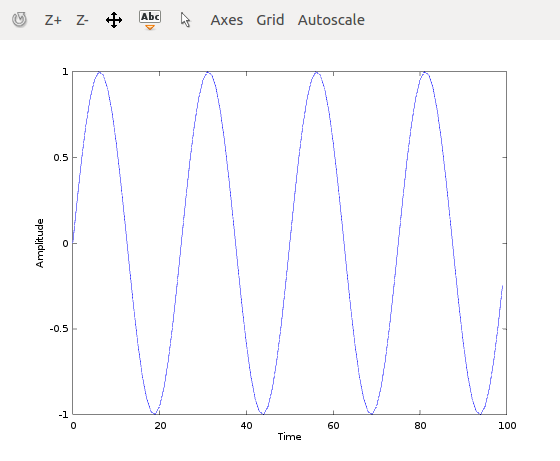
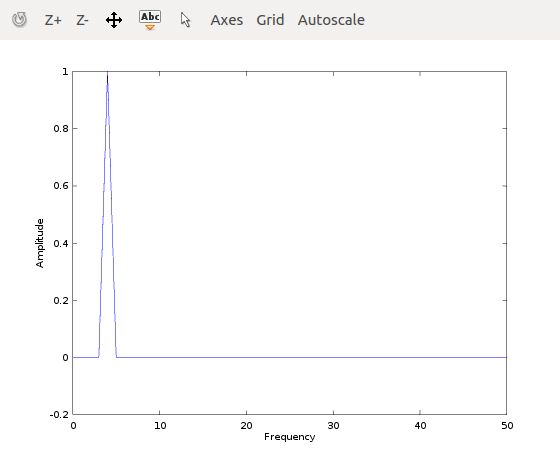
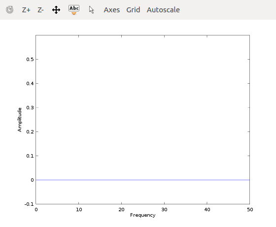
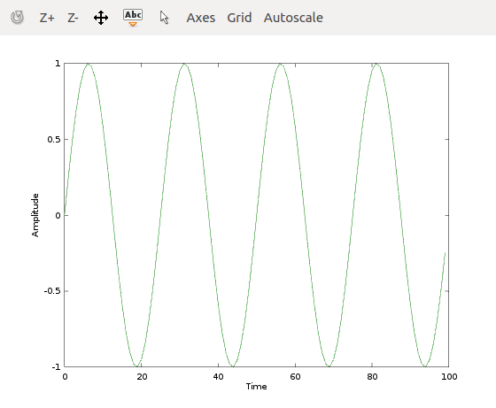

# Fourier Analysis

### This is MATLAB implementation of a Fourier Transform and Inverse Fourier Transform

### To run, clone this repository, start MATLAB or Octave and run main.m

### Fourier Transform
Signals, such as sound waves can be recorded as changes with time. These signals can be represented differently (transformed) into frequencies. The advantage is that you can represent the same signal with less information. More precisely, by performing a fourier transform, you transform and effectively condense the information of the raw data into a set of values that can be used to (almost) perfectly reconstruct the original signal.

We have a signal in the time domain:

]

Perform a Fourier Transform:

]
]

The first graph contains information about the cosine parts of the signal and the second is for sines. The information we take away is that there is a spike at a frequency of 5 cycles/second for the cosine part, and nothing for the sine part.

With the information from above, we can perform an Inverse Fourier Transform to reconstruct the original signal:

